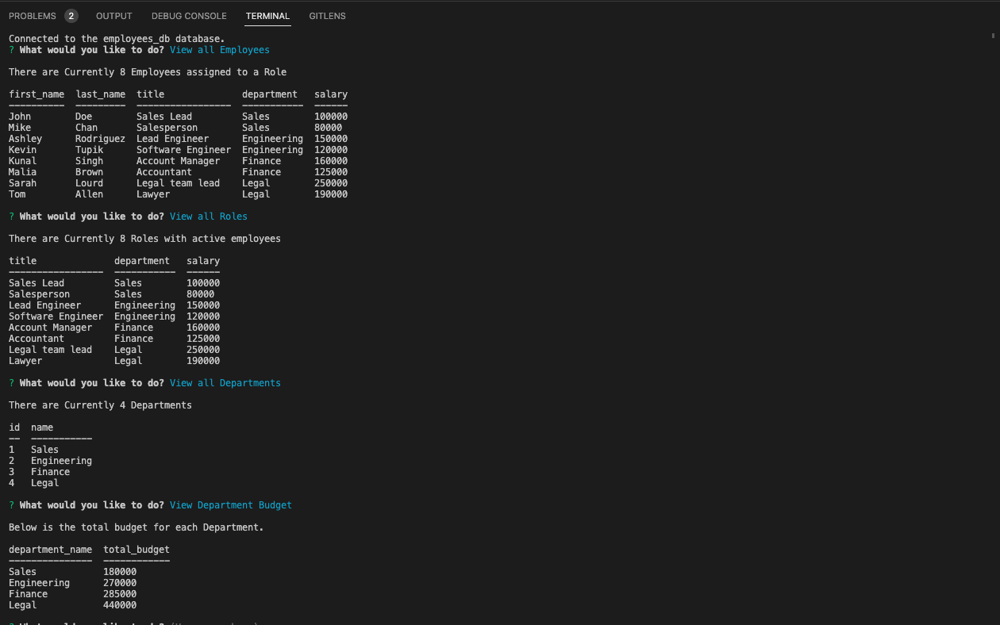

# staff-tracker
## Description
This application is a command line employee tracking tool built using the mysql2 library in Node.js. It allows users to view a database of employees, roles and departments. The user can also modify the data from the command line, by selecting options from a series of prompts. To use the application, the user will need to follow all directions as listed in the [Installation](#installation) section. 

## Table of Contents
* [Installation](#installation)
* [Links](#Links)
* [Usage](#usage)
* [License](#license)
* [Contribute](#contribute)
* [Tests](#tests)
* [Questions](#questions)

## Installation
If you want to run a copy of this app on your local machine, first clone the repository:

Clone Via HTTPS:
```$ git clone https://github.com/Steven-McCombe/staff-tracker.git```

Clone Via SSH:
```$ git clone git@github.com:Steven-McCombe/staff-tracker.git```

Input your mysql username and password in the server.js file at line 24.
``` password: ''```

Cd/ into the cloned directory and install the dependencies by typing the following into the command line
```$ npm install --save```

To start the application type the following into the address bar
```$ node server.js```

## Usage
Video Demonstration (click image):

[](https://drive.google.com/file/d/1zgWW3dTMC8H9NuIxUupbNteBOLvI6ONu/view)

## License 
   

  [Read more about MIT License here.](https://opensource.org/licenses/MIT)
  
  
## Contribute
N/A

## Tests
N/A

## Questions
Contact Links:
- [Github Profile](https://github.com/STEVEN-MCCOMBE)
- [E-mail Me](mailto:smccombe93@gmail.com)

